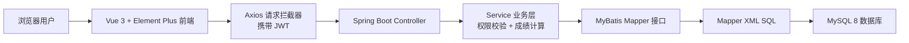
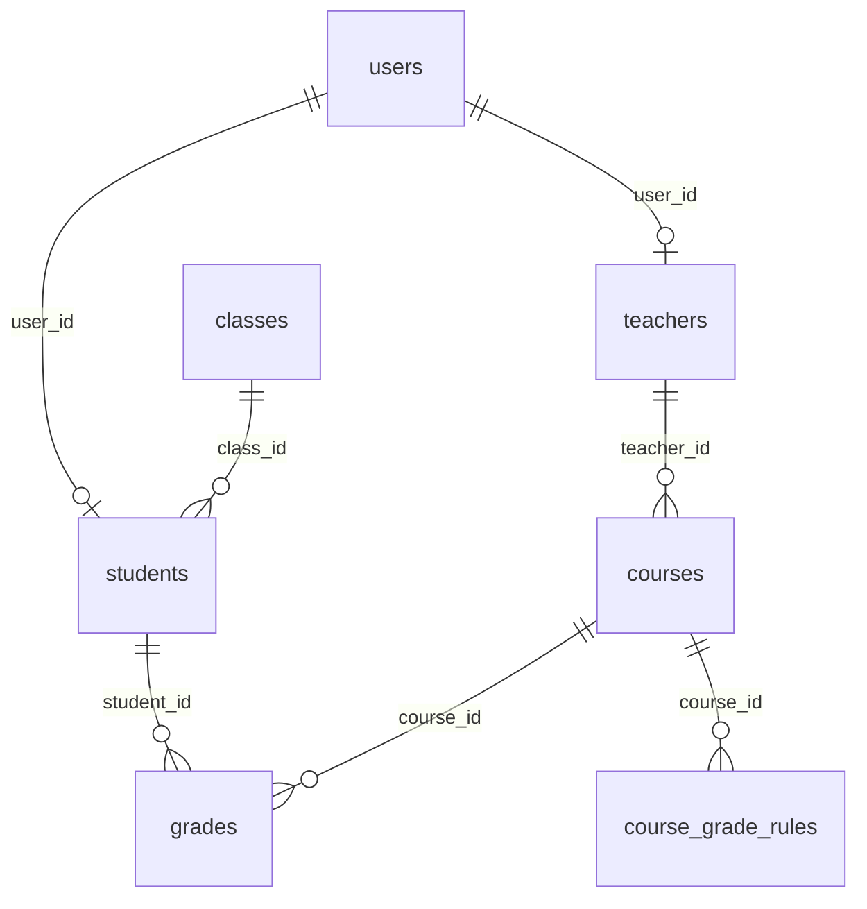

# 高校成绩管理系统答辩讲解与高频问题

> 项目名称：高校成绩管理系统  
> 技术栈：Spring Boot 3 + Spring Security + JWT + 原生 MyBatis XML + MySQL 8 + Vue 3 + Vite + Element Plus + Pinia + Axios  
> 适用场景：Java 程序设计课程设计最终答辩、项目演示、老师现场提问

## 0. 先把这个项目的完整流程讲清楚

这一节是答辩时最重要的。老师问项目，一般不是想听一堆技术名词，而是想确认你们真的知道“这个系统从用户打开页面开始，到数据进入数据库，再到页面显示结果，中间到底发生了什么”。

可以先记住一句总流程：

```text
用户在 Vue 前端页面操作
  -> Axios 调用 Spring Boot 后端接口
  -> Spring Security + JWT 判断是谁、有没有登录
  -> Controller 接收请求
  -> Service 判断权限并处理业务
  -> Mapper 调用 MyBatis XML SQL
  -> MySQL 查询或保存数据
  -> 后端返回统一结果
  -> 前端刷新页面显示
```

如果老师让你们“讲一下系统怎么实现的”，就按下面这个顺序讲。

### 0.1 项目运行起来以后，用户看到什么

项目启动后分成两部分：

| 部分 | 地址 | 作用 |
|---|---|---|
| 后端 | `http://localhost:8080` | 提供接口，比如登录、查课程、保存成绩 |
| 前端 | `http://127.0.0.1:5173` | 用户真正打开和操作的后台管理页面 |

用户不会直接操作数据库，也不会直接访问 Java 类。用户只是在浏览器里打开前端页面，比如登录页、课程管理页、成绩录入页。前端页面再通过接口去请求后端。

通俗说：

```text
浏览器页面是“前台窗口”
Spring Boot 是“办业务的人”
MySQL 是“保存档案的柜子”
MyBatis 是“帮 Java 去柜子里取资料的工具”
```

答辩时可以这样说：

本项目是前后端分离系统。前端负责页面展示和用户交互，后端负责业务判断、权限控制和数据处理，数据库负责持久化保存数据。用户所有操作最终都会变成一次 HTTP 接口请求，由后端处理后再返回给前端显示。

### 0.2 第一步：用户登录流程

用户打开系统后，首先看到登录页。登录页对应前端文件：

```text
frontend/src/views/LoginView.vue
```

用户输入用户名和密码，例如：

```text
admin / admin123
teacher01 / 123456
student01 / 123456
```

点击登录后，前端会调用：

```js
await auth.login(form)
```

这个 `auth.login` 在：

```text
frontend/src/stores/auth.js
```

它继续调用 API：

```js
const result = await authApi.login(form)
```

API 地址在：

```text
frontend/src/api/index.js
```

对应接口是：

```text
POST /api/auth/login
```

因为 Vite 配置了代理：

```js
proxy: {
  '/api': 'http://localhost:8080'
}
```

所以前端访问 `/api/auth/login`，实际会转发到后端：

```text
http://localhost:8080/api/auth/login
```

后端接收这个请求的代码在：

```text
backend/src/main/java/com/example/campusgrade/controller/AuthController.java
```

核心代码：

```java
@PostMapping("/login")
public ApiResponse<LoginResponse> login(@Valid @RequestBody LoginRequest request) {
    return ApiResponse.ok(authService.login(request));
}
```

这段代码说明：Controller 不自己判断用户名密码，而是交给 `AuthService`。

`AuthService` 做三件事：

1. 根据用户名查数据库里的用户。
2. 判断密码对不对、账号有没有停用。
3. 登录成功后生成 JWT token 返回给前端。

核心代码：

```java
User user = userMapper.findByUsername(request.username);
if (user == null || user.status == null || user.status != 1) {
    throw new BusinessException("账号不存在或已停用");
}
if (!passwordMatches(request.password, user.password)) {
    throw new BusinessException("用户名或密码错误");
}
user.password = null;
return new LoginResponse(jwtTokenProvider.createToken(user), user);
```

这里的 `userMapper.findByUsername` 会通过 MyBatis XML 去查 `users` 表。

登录成功后，后端返回：

```text
token + 当前用户信息
```

前端收到后会保存：

```js
this.token = result.token
this.user = result.user
localStorage.setItem('token', result.token)
localStorage.setItem('user', JSON.stringify(result.user))
```

这一步的意义：

前端保存 token 后，用户后面访问其他页面时就不用每次重新登录。后续每次请求，Axios 都会自动把 token 放到请求头里。

### 0.3 第二步：登录后为什么能看到不同菜单

登录成功后进入主页面，主页面布局文件是：

```text
frontend/src/layout/MainLayout.vue
```

这个页面有左侧菜单、顶部用户信息、右侧内容区域。

菜单不是写死给所有人看的，而是根据当前用户角色过滤：

```js
const menus = computed(() => menuRoutes
  .filter((route) => route.meta.roles.includes(auth.role))
  .map((route, index) => ({ ...route, icon: icons[index % icons.length] })))
```

路由文件是：

```text
frontend/src/router/index.js
```

里面每个页面都配置了允许访问的角色：

```js
{ path: '/admin/users', meta: { title: '用户管理', roles: ['ADMIN'] } }
{ path: '/teacher/grades', meta: { title: '成绩录入', roles: ['TEACHER'] } }
{ path: '/student/grades', meta: { title: '我的成绩', roles: ['STUDENT'] } }
```

所以：

| 登录角色 | 能看到的页面 |
|---|---|
| 管理员 | 用户、学生、教师、班级、课程、成绩规则、成绩、统计 |
| 教师 | 我的课程、成绩规则、成绩录入、课程统计 |
| 学生 | 个人信息、我的成绩、成绩汇总 |

这里要特别注意：

前端菜单控制只是让界面更清楚，不是真正的安全保障。真正的权限判断必须在后端做，因为别人可以绕过页面直接调用接口。

答辩时可以这样说：

前端通过路由元信息 `meta.roles` 控制菜单显示和页面跳转，后端再通过 Spring Security 和 Service 层业务校验保证接口安全。也就是说，前端负责“不给你看入口”，后端负责“就算你直接调接口也不能越权”。

### 0.4 第三步：每次请求后端怎么知道你是谁

前端所有请求都走这个文件：

```text
frontend/src/utils/request.js
```

请求拦截器代码：

```js
request.interceptors.request.use((config) => {
  const token = localStorage.getItem('token')
  if (token) config.headers.Authorization = `Bearer ${token}`
  return config
})
```

意思是：

每次请求后端前，先从浏览器 localStorage 里取 token，如果有 token，就放到 HTTP 请求头：

```text
Authorization: Bearer xxxxxx
```

后端收到请求后，先经过 JWT 过滤器：

```text
backend/src/main/java/com/example/campusgrade/security/JwtAuthenticationFilter.java
```

过滤器会做这些事：

1. 从请求头读取 `Authorization`。
2. 判断是不是 `Bearer token` 格式。
3. 解析 token 得到用户名。
4. 根据用户名重新查询数据库用户。
5. 如果用户存在且启用，就把当前用户放进 Spring Security 上下文。

核心代码：

```java
String header = request.getHeader("Authorization");
if (header != null && header.startsWith("Bearer ")) {
    String username = jwtTokenProvider.getUsername(header.substring(7));
    User user = userMapper.findByUsername(username);
    if (user != null && user.status != null && user.status == 1) {
        CurrentUser principal = new CurrentUser(user.id, user.username, user.realName, user.role);
        UsernamePasswordAuthenticationToken authentication =
                new UsernamePasswordAuthenticationToken(
                        principal,
                        null,
                        List.of(new SimpleGrantedAuthority("ROLE_" + user.role))
                );
        SecurityContextHolder.getContext().setAuthentication(authentication);
    }
}
```

这一步完成后，后端就知道：

```text
当前请求是谁发的
这个人是什么角色
这个人能不能访问对应接口
```

如果老师问“为什么后端知道当前是老师还是学生”，就回答：

登录后 JWT 中保存了用户名和角色信息，后续请求通过请求头携带 JWT，后端过滤器解析 token 后，把当前用户和角色放入 Spring Security 上下文。Service 层可以通过 `SecurityUtils.currentUser()` 获取当前登录用户。

### 0.5 第四步：管理员的业务流程

管理员是系统基础数据维护者。

管理员登录后通常操作顺序是：

```text
维护用户
  -> 维护班级
  -> 维护学生档案
  -> 维护教师档案
  -> 维护课程
  -> 维护课程成绩规则
  -> 查看或管理成绩
  -> 查看统计
```

这些数据之间是有关联的：

```text
用户 users
  -> 学生 students 关联 user_id
  -> 教师 teachers 关联 user_id

班级 classes
  -> 学生 students 关联 class_id

教师 teachers
  -> 课程 courses 关联 teacher_id

课程 courses
  -> 成绩规则 course_grade_rules 关联 course_id
  -> 成绩 grades 关联 course_id

学生 students
  -> 成绩 grades 关联 student_id
```

也就是说，系统不是孤立表单，而是一套有关联的数据模型。

例如新增一门课程时，课程表要保存：

```text
课程编号
课程名称
学分
任课教师 ID
学期
平时成绩占比
期末成绩占比
```

课程表 `courses` 中最关键的两个字段是：

```sql
usual_weight DECIMAL(5,2) NOT NULL DEFAULT 30.00,
final_weight DECIMAL(5,2) NOT NULL DEFAULT 70.00
```

这两个字段决定这门课程怎么计算总评。

答辩时可以这样说：

管理员负责准备系统的基础数据。比如先有用户账号，再把某些账号关联成学生或教师；课程必须关联任课教师；成绩必须关联学生和课程。这样设计可以保证数据之间有明确关系，而不是简单堆在一张表里。

### 0.6 第五步：教师的业务流程

教师登录后，系统重点限制两个字：本人。

教师流程是：

```text
教师登录
  -> 查看“我的课程”
  -> 选择自己负责的课程
  -> 配置这门课的成绩规则
  -> 给学生录入平时分和期末分
  -> 后端自动计算总评和绩点
  -> 教师查看课程统计
```

教师能看到哪些课程？

前端调用：

```text
GET /api/courses
```

后端 `CourseController` 调用：

```java
courseService.visibleCourses()
```

`CourseService.visibleCourses()` 里判断：

```java
public List<Course> visibleCourses() {
    if (SecurityUtils.isTeacher()) {
        return courseMapper.findByTeacherId(currentTeacherId());
    }
    return courseMapper.findAll();
}
```

意思是：

如果当前登录用户是教师，只查询 `teacher_id = 当前教师ID` 的课程；如果是管理员，查询全部课程。

教师修改成绩规则或录入成绩时，还会调用：

```java
courseService.assertTeacherOwnsCourse(request.courseId);
```

这个方法会检查课程是否属于当前教师：

```java
if (!course.teacherId.equals(currentTeacherId())) {
    throw new BusinessException("教师只能管理本人负责课程");
}
```

所以教师即使手动把请求里的 `courseId` 改成别的老师的课程，后端也会拒绝。

答辩时可以这样说：

教师权限不是简单判断角色是 TEACHER 就结束，还要判断业务数据归属。也就是这个老师只能操作自己负责的课程，这个判断在 Service 层完成。

### 0.7 第六步：学生的业务流程

学生登录后只能查看自己的数据。

学生流程是：

```text
学生登录
  -> 查看个人信息
  -> 查看我的成绩
  -> 查看成绩汇总
```

学生查看成绩时，前端调用：

```text
GET /api/grades
```

后端 `GradeService.visibleGrades()` 会判断当前角色：

```java
public List<Grade> visibleGrades() {
    if (SecurityUtils.isStudent()) {
        return gradeMapper.findByStudentId(currentStudentId());
    }
    if (SecurityUtils.isTeacher()) {
        return gradeMapper.findByTeacherId(courseService.currentTeacherId());
    }
    return gradeMapper.findAll();
}
```

这个方法很重要，因为同一个 `/api/grades` 接口，不同角色查到的数据不一样：

| 当前角色 | `/api/grades` 返回 |
|---|---|
| 学生 | 只返回当前学生自己的成绩 |
| 教师 | 只返回当前教师课程下的成绩 |
| 管理员 | 返回全部成绩 |

学生自己的 ID 不是前端传来的，而是后端根据当前登录账号查出来：

```java
Student student = studentMapper.findByUserId(SecurityUtils.currentUser().id);
```

这可以防止学生把请求参数改成别人的学生 ID。

答辩时可以这样说：

学生查询成绩时，系统不相信前端传来的学生 ID，而是根据当前登录用户在后端查出对应学生档案，再查询该学生的成绩。这样可以防止学生查看其他人的成绩。

### 0.8 第七步：成绩规则配置流程

这是本项目的核心流程之一。

管理员或任课教师进入“成绩规则”页面后，会先选择课程。前端调用：

```text
GET /api/courses/{courseId}/grade-rules
```

后端返回这门课的完整规则：

```text
courseId
usualWeight
finalWeight
rules: [
  { minScore, maxScore, gradePoint, label },
  ...
]
```

也就是：

```text
课程自己的平时/期末权重
+ 课程自己的绩点区间表
```

保存规则时，前端调用：

```text
POST /api/courses/{courseId}/grade-rules
```

后端入口：

```text
backend/src/main/java/com/example/campusgrade/controller/GradeRuleController.java
```

Controller 调用：

```java
manageService.saveConfig(courseId, config)
```

真正保存逻辑在：

```text
backend/src/main/java/com/example/campusgrade/service/GradeRuleManageService.java
```

核心流程：

```java
gradeRuleService.validateWeights(config.usualWeight, config.finalWeight);
courseService.updateWeights(courseId, config.usualWeight, config.finalWeight);
saveRules(courseId, config.rules);
return getConfig(courseId);
```

这几行按顺序做了四件事：

1. 校验平时占比 + 期末占比是否等于 100。
2. 把权重保存到 `courses` 表。
3. 保存这门课的绩点规则到 `course_grade_rules` 表。
4. 重新查询保存后的完整配置返回给前端。

为什么这里要用事务？

```java
@Transactional
public CourseGradeRuleConfig saveConfig(...)
```

因为保存规则不是只改一张表：

```text
更新 courses 表的权重
删除 course_grade_rules 表旧规则
插入 course_grade_rules 表新规则
```

如果中间某一步失败，应该一起回滚，不然会出现“权重改了，但是绩点规则没保存完整”的问题。

### 0.9 第八步：成绩录入流程

这是答辩最容易被问的核心业务。

老师录入成绩时，前端页面只让输入：

```text
学生 ID
课程 ID
平时成绩 usualScore
期末成绩 finalScore
备注
```

注意：不输入总评，不输入绩点。

前端文件：

```text
frontend/src/views/teacher/TeacherGradesView.vue
frontend/src/views/admin/GradesView.vue
```

字段配置中只有：

```js
{ prop: 'usualScore', label: '平时成绩', type: 'number', min: 0, max: 100 },
{ prop: 'finalScore', label: '期末成绩', type: 'number', min: 0, max: 100 },
```

保存时前端调用：

```text
POST /api/grades
```

后端入口：

```text
backend/src/main/java/com/example/campusgrade/controller/GradeController.java
```

Controller 调用：

```java
return ApiResponse.ok(gradeService.save(request));
```

真正业务在 `GradeService.save()`。

完整思路是：

```text
1. 判断当前用户是不是学生
   -> 学生不能录入成绩

2. 判断当前教师是否拥有这门课程
   -> 教师不能改别人课程

3. 根据 courseId 查询课程
   -> 得到 usualWeight 和 finalWeight

4. 查询 course_grade_rules
   -> 得到这门课自己的绩点换算表

5. 根据平时分、期末分、课程权重计算总评

6. 根据总评和这门课的绩点规则计算绩点

7. 保存 grades 表
```

对应代码：

```java
Course course = courseService.findRequiredCourse(request.courseId);
List<CourseGradeRule> rules = ruleMapper.findByCourseId(request.courseId);

BigDecimal totalScore = gradeRuleService.calculateTotalScore(
        request.usualScore,
        request.finalScore,
        course.usualWeight,
        course.finalWeight
);

BigDecimal gradePoint = gradeRuleService.calculateGradePoint(rules, totalScore);
```

这就是系统的核心：后端根据课程配置自动算结果。

答辩时可以这样讲：

本系统录入成绩时不让用户手动输入总评和绩点，因为这两个字段属于业务计算结果。老师只输入原始成绩，也就是平时分和期末分。后端根据该课程的权重计算总评，再根据该课程自己的绩点规则计算绩点。这样可以保证不同课程使用不同规则，也能防止前端篡改计算结果。

### 0.10 第九步：一个具体例子讲清成绩计算

假设有两门课：

| 课程 | 平时占比 | 期末占比 | 绩点规则 |
|---|---:|---:|---|
| 高等数学 | 30% | 70% | 80-89.99 分是 3.7 |
| Java 程序设计 | 40% | 60% | 85-94.99 分是 3.3 |

如果某学生两门课都是：

```text
平时分 = 85
期末分 = 85
```

高等数学总评：

```text
85 * 30 / 100 + 85 * 70 / 100 = 85
```

高等数学 85 分落在 80-89.99，所以绩点是 3.7。

Java 程序设计总评：

```text
85 * 40 / 100 + 85 * 60 / 100 = 85
```

Java 85 分落在 85-94.99，所以绩点是 3.3。

这个例子要记住，因为它最能证明：

```text
同样的分数，在不同课程中可以得到不同绩点
原因是每门课程有自己的绩点规则
```

老师如果问“你们这个成绩规则有什么特别的”，就讲这个例子。

### 0.11 第十步：成绩查询和统计流程

成绩保存到数据库以后，不同角色可以查询。

管理员查成绩：

```text
查全部 grades
```

教师查成绩：

```text
只查自己课程下的 grades
```

学生查成绩：

```text
只查自己 studentId 对应的 grades
```

成绩列表 SQL 不是只查成绩表，而是多表关联：

```xml
SELECT g.*, s.student_no, s.name AS student_name, cl.class_name,
       c.course_code, c.course_name, c.credit, c.teacher_id,
       t.name AS teacher_name
FROM grades g
JOIN students s ON s.id = g.student_id
JOIN classes cl ON cl.id = s.class_id
JOIN courses c ON c.id = g.course_id
JOIN teachers t ON t.id = c.teacher_id
```

这样页面可以直接显示：

```text
学号、学生姓名、班级、课程名、教师名、平时分、期末分、总评、绩点
```

统计流程也是类似的：

前端调用：

```text
GET /api/statistics/overview
GET /api/statistics/courses/{courseId}
GET /api/statistics/student-summary
```

后端用 SQL 计算：

```text
平均分
最高分
最低分
及格率
分数段人数
学生平均绩点
```

答辩时可以这样说：

成绩统计没有在前端自己算，而是在后端通过 SQL 聚合计算。这样统计口径统一，也避免前端拿到过多不该看的数据。

### 0.12 把“前端、后端、数据库”三者关系说清楚

很多同学答辩时容易把前端和后端混在一起。可以这样理解：

| 层 | 本项目对应文件 | 做什么 | 不做什么 |
|---|---|---|---|
| 前端页面 | `frontend/src/views` | 显示表格、表单、按钮 | 不直接查数据库 |
| 前端状态 | `frontend/src/stores/auth.js` | 保存当前登录用户和 token | 不判断最终业务权限 |
| 前端请求 | `frontend/src/utils/request.js` | 统一加 token、处理响应 | 不计算最终成绩 |
| 后端 Controller | `backend/.../controller` | 接收接口请求、返回结果 | 不写复杂业务 |
| 后端 Service | `backend/.../service` | 权限判断、业务校验、成绩计算 | 不直接写 SQL |
| Mapper 接口 | `backend/.../mapper` | 定义数据库操作方法 | 不处理业务规则 |
| Mapper XML | `backend/src/main/resources/mapper` | 写 SQL 查询、插入、更新、删除 | 不判断用户角色 |
| MySQL | `database/schema.sql` | 保存系统数据 | 不负责页面展示 |

一句话：

```text
前端负责“看和点”，后端负责“判断和算”，数据库负责“存和查”。
```

### 0.13 如果老师从一个按钮问起，怎么回答

比如老师指着“保存成绩”按钮问：点这个按钮发生了什么？

可以按这个链路回答：

```text
1. 用户在 Vue 页面点击保存按钮。
2. SimpleCrud 组件调用 save 方法。
3. save 方法根据有没有 id 判断是新增还是修改。
4. 新增调用 gradeApi.create，也就是 POST /api/grades。
5. Axios 请求拦截器自动携带 JWT。
6. Spring Security 的 JWT 过滤器解析当前用户。
7. GradeController 接收请求。
8. GradeService.save 做权限判断和成绩计算。
9. GradeMapper 调用 GradeMapper.xml 的 insert 或 update。
10. MySQL 保存成绩。
11. 后端返回 ApiResponse。
12. 前端提示保存成功，并重新加载表格。
```

这个回答非常适合答辩，因为它把页面、接口、权限、业务、数据库全部串起来了。

### 0.14 如果老师问“这个项目最核心的代码在哪里”

可以回答三个位置：

第一，登录认证核心：

```text
AuthService.java
JwtTokenProvider.java
JwtAuthenticationFilter.java
SecurityConfig.java
```

第二，权限和课程归属核心：

```text
SecurityUtils.java
CourseService.java
```

第三，成绩计算核心：

```text
GradeService.java
GradeRuleService.java
GradeRuleManageService.java
CourseGradeRuleMapper.xml
GradeMapper.xml
```

答辩时重点讲第三部分，因为这是最贴合项目业务的。

### 0.15 你们两个人可以这样分工讲

如果答辩是两个人，可以这样分：

第一个人讲整体和前端：

```text
项目背景
三类角色
前后端分离架构
登录页面
角色菜单
管理员、教师、学生页面流程
```

第二个人讲后端和核心业务：

```text
JWT 认证
后端分层
数据库表关系
课程级成绩规则
成绩录入自动计算总评和绩点
权限校验
统计查询
```

如果老师随机提问，两个人都至少要会讲：

```text
登录流程
成绩录入流程
教师只能操作自己课程的原因
学生只能看自己成绩的原因
课程级成绩规则为什么是亮点
```

## 1. 答辩时的一分钟总述

老师好，我们做的是一个基于 Web 的高校成绩管理系统，主要面向管理员、教师和学生三类用户。

系统采用前后端分离架构。后端使用 Spring Boot 提供 REST API，使用 Spring Security 和 JWT 实现登录认证，使用 MyBatis Mapper 接口加 XML SQL 访问 MySQL 8 数据库；前端使用 Vue 3、Vite、Element Plus 搭建后台管理风格页面，使用 Pinia 保存登录状态，使用 Axios 统一请求接口并携带 JWT。

业务上系统实现了用户管理、学生管理、教师管理、班级管理、课程管理、成绩规则管理、成绩录入查询和统计分析。项目的重点不是简单录入一个总分，而是每门课程可以独立配置成绩计算规则：课程表中保存平时成绩占比和期末成绩占比，`course_grade_rules` 表保存该课程自己的绩点换算区间。录入成绩时，老师只输入平时分和期末分，后端根据该课程的权重自动计算总评，再根据该课程自己的绩点规则计算绩点，避免前端或用户手动填写总分造成不一致。

权限方面，管理员可以管理全部基础数据；教师只能看到自己的课程，只能管理自己课程的成绩和成绩规则；学生只能查看自己的信息、成绩和汇总。前端通过菜单和路由做体验层面的控制，后端通过 Spring Security 注解和 Service 层归属校验做真正的安全控制。

## 2. 项目目录和职责划分

```text
campus-grade-management
├─ backend/                       Spring Boot 后端
│  ├─ src/main/java/com/example/campusgrade
│  │  ├─ common/                  统一响应、业务异常、全局异常处理
│  │  ├─ config/                  Spring Security 配置
│  │  ├─ controller/              REST 接口层
│  │  ├─ dto/                     请求和统计返回对象
│  │  ├─ entity/                  数据库实体对象
│  │  ├─ mapper/                  MyBatis Mapper 接口
│  │  ├─ security/                JWT、当前登录用户、权限工具
│  │  └─ service/                 业务逻辑层
│  └─ src/main/resources/mapper   MyBatis XML SQL
├─ frontend/                      Vue 3 前端
│  └─ src
│     ├─ api/                     API 封装
│     ├─ components/              通用 CRUD 表格组件
│     ├─ layout/                  后台管理布局
│     ├─ router/                  路由和角色控制
│     ├─ stores/                  Pinia 登录状态
│     ├─ utils/                   Axios 请求实例
│     └─ views/                   管理员、教师、学生页面
├─ database/
│  ├─ schema.sql                  建库建表脚本
│  └─ seed.sql                    初始账号和演示数据
└─ docs/
   ├─ report/                     课程设计报告和截图
   └─ 答辩讲解与高频问题.md       本文档
```

答辩说法：

项目采用常见的分层架构。Controller 只负责接收请求和返回统一结果；Service 负责权限判断、业务校验和成绩计算；Mapper 负责数据库访问；XML 中集中编写 SQL，方便课程设计中展示原生 MyBatis 的使用。

## 3. 技术选型怎么解释

### 3.1 为什么用 Spring Boot

Spring Boot 适合快速搭建 Java Web 后端。它提供自动配置、内嵌 Tomcat、统一配置文件和依赖管理，可以让我们把重点放在业务逻辑上，比如登录、权限、成绩计算规则，而不是花大量时间配置传统 Spring MVC。

项目入口：

```java
// backend/src/main/java/com/example/campusgrade/CampusGradeApplication.java
@SpringBootApplication
public class CampusGradeApplication {
    public static void main(String[] args) {
        SpringApplication.run(CampusGradeApplication.class, args);
    }
}
```

### 3.2 为什么用 MyBatis XML

本项目明确要求使用原生 MyBatis Mapper 接口和 XML SQL。这样做的优点是 SQL 比较直观，适合课程设计答辩展示表连接、统计查询和动态业务数据。

例如成绩列表不是只查 `grades` 一张表，而是连接学生、班级、课程、教师表，把页面需要展示的信息一次查出：

```xml
<!-- backend/src/main/resources/mapper/GradeMapper.xml -->
<sql id="gradeSelect">
    SELECT g.*, s.student_no, s.name AS student_name, cl.class_name, c.course_code, c.course_name,
           c.credit, c.teacher_id, t.name AS teacher_name
    FROM grades g
    JOIN students s ON s.id = g.student_id
    JOIN classes cl ON cl.id = s.class_id
    JOIN courses c ON c.id = g.course_id
    JOIN teachers t ON t.id = c.teacher_id
</sql>
```

答辩说法：

Mapper 接口定义 Java 方法，XML 负责具体 SQL。这样分工清晰，复杂查询更容易维护，也符合课程要求。

### 3.3 为什么用 JWT

JWT 的特点是无状态。登录成功后后端签发 token，前端保存 token，后续请求在请求头中带上 `Authorization: Bearer token`。后端通过过滤器解析 token，不需要在服务器保存 Session，适合前后端分离项目。

## 4. 系统总体架构



完整请求流程：

1. 用户访问前端登录页，输入用户名和密码。
2. 前端调用 `/api/auth/login`。
3. 后端校验账号密码，生成 JWT，返回用户信息。
4. 前端 Pinia 保存用户信息，localStorage 保存 token。
5. 后续请求由 Axios 拦截器自动加上 `Authorization` 请求头。
6. 后端 JWT 过滤器解析 token，把当前用户放进 Spring Security 上下文。
7. Controller 调用 Service。
8. Service 根据角色做业务权限校验，例如教师只能操作自己的课程。
9. Mapper 调用 XML SQL 访问 MySQL。
10. 后端通过 `ApiResponse` 返回统一格式，前端渲染表格、表单和统计数据。

## 5. 数据库设计讲解

### 5.1 核心表

| 表名 | 作用 |
|---|---|
| `users` | 登录账号表，保存用户名、密码、真实姓名、角色、状态 |
| `classes` | 班级表，保存班级名称、年级、专业 |
| `students` | 学生档案表，关联 `users` 和 `classes` |
| `teachers` | 教师档案表，关联 `users` |
| `courses` | 课程表，关联任课教师，并保存课程自己的成绩权重 |
| `course_grade_rules` | 课程绩点规则表，每门课独立配置分数区间和绩点 |
| `grades` | 成绩表，保存平时分、期末分、后端计算出的总评和绩点 |

### 5.2 表关系



### 5.3 成绩规则为什么拆成两部分

本系统的核心规则是“成绩计算不是全局统一的，而是按课程配置”。

第一部分：`courses` 表保存权重。

```sql
usual_weight DECIMAL(5,2) NOT NULL DEFAULT 30.00,
final_weight DECIMAL(5,2) NOT NULL DEFAULT 70.00
```

第二部分：`course_grade_rules` 表保存绩点区间。

```sql
CREATE TABLE course_grade_rules (
  id BIGINT PRIMARY KEY AUTO_INCREMENT,
  course_id BIGINT NOT NULL,
  min_score DECIMAL(5,2) NOT NULL,
  max_score DECIMAL(5,2) NOT NULL,
  grade_point DECIMAL(3,1) NOT NULL,
  label VARCHAR(50) NOT NULL,
  CONSTRAINT fk_rules_course FOREIGN KEY (course_id) REFERENCES courses(id) ON DELETE CASCADE,
  INDEX idx_rules_course_score (course_id, min_score, max_score)
);
```

答辩说法：

权重属于课程本身，所以放在 `courses` 表；绩点区间一门课有多条，所以单独建 `course_grade_rules` 表，一对多关联课程。这样可以支持不同课程使用不同的平时/期末占比，也可以支持不同课程使用不同绩点换算标准。

### 5.4 为什么 `grades` 表保存 `total_score` 和 `grade_point`

`grades` 表中保存：

```sql
usual_score DECIMAL(5,2) NOT NULL,
final_score DECIMAL(5,2) NOT NULL,
total_score DECIMAL(5,2) NOT NULL,
grade_point DECIMAL(3,1) NOT NULL
```

可能被问：

老师：既然总评和绩点可以计算，为什么还要存？

回答：

这里是演示版系统，保存计算结果可以让成绩列表、学生成绩单、统计分析查询更直接，避免每次统计都重新计算，提高查询方便性。真正生产系统中，如果规则可能频繁追溯修改，可以增加规则版本字段，保存当时使用的规则版本，或者每次动态计算。当前课程设计中，保存计算结果更符合演示和查询需求。

### 5.5 唯一约束

```sql
CONSTRAINT uk_grades_student_course UNIQUE (student_id, course_id)
```

作用：一个学生在同一门课程下只能有一条成绩记录，防止重复录入。

## 6. 登录认证流程

### 6.1 后端登录接口

文件：`backend/src/main/java/com/example/campusgrade/controller/AuthController.java`

```java
@PostMapping("/login")
public ApiResponse<LoginResponse> login(@Valid @RequestBody LoginRequest request) {
    return ApiResponse.ok(authService.login(request));
}
```

Controller 不直接写登录逻辑，而是交给 `AuthService`。

### 6.2 登录业务逻辑

文件：`backend/src/main/java/com/example/campusgrade/service/AuthService.java`

```java
public LoginResponse login(LoginRequest request) {
    User user = userMapper.findByUsername(request.username);
    if (user == null || user.status == null || user.status != 1) {
        throw new BusinessException("账号不存在或已停用");
    }
    if (!passwordMatches(request.password, user.password)) {
        throw new BusinessException("用户名或密码错误");
    }
    user.password = null;
    return new LoginResponse(jwtTokenProvider.createToken(user), user);
}
```

讲解重点：

1. 根据用户名查用户。
2. 判断账号是否存在、是否启用。
3. 校验密码。
4. 返回前把密码置空，避免泄露给前端。
5. 生成 JWT 返回。

### 6.3 密码处理

文件：`backend/src/main/java/com/example/campusgrade/service/UserService.java`

新增用户时：

```java
user.password = passwordEncoder.encode(user.password == null || user.password.isBlank() ? "123456" : user.password);
```

说明：

系统新增用户使用 BCrypt 加密保存密码。种子数据为了课程演示方便保留了明文密码，`AuthService` 做了兼容：如果数据库密码以 `$2` 开头，就按 BCrypt 校验；否则按演示数据明文比较。

答辩建议：

如果老师问安全性，可以主动说明：正式系统应该把种子数据中的密码也改成 BCrypt 密文，并且 JWT secret 应该使用环境变量而不是写死在配置中。

### 6.4 JWT 生成

文件：`backend/src/main/java/com/example/campusgrade/security/JwtTokenProvider.java`

```java
public String createToken(User user) {
    Instant now = Instant.now();
    return Jwts.builder()
            .subject(user.username)
            .claim("uid", user.id)
            .claim("role", user.role)
            .issuedAt(Date.from(now))
            .expiration(Date.from(now.plus(expirationHours, ChronoUnit.HOURS)))
            .signWith(secretKey)
            .compact();
}
```

JWT 中保存：

| 字段 | 含义 |
|---|---|
| `subject` | 用户名 |
| `uid` | 用户 ID |
| `role` | 用户角色 |
| `issuedAt` | 签发时间 |
| `expiration` | 过期时间 |

### 6.5 JWT 过滤器

文件：`backend/src/main/java/com/example/campusgrade/security/JwtAuthenticationFilter.java`

```java
String header = request.getHeader("Authorization");
if (header != null && header.startsWith("Bearer ")) {
    String username = jwtTokenProvider.getUsername(header.substring(7));
    User user = userMapper.findByUsername(username);
    if (user != null && user.status != null && user.status == 1) {
        CurrentUser principal = new CurrentUser(user.id, user.username, user.realName, user.role);
        UsernamePasswordAuthenticationToken authentication =
                new UsernamePasswordAuthenticationToken(
                        principal,
                        null,
                        List.of(new SimpleGrantedAuthority("ROLE_" + user.role))
                );
        SecurityContextHolder.getContext().setAuthentication(authentication);
    }
}
```

讲解重点：

过滤器从请求头取 token，解析用户名，再查数据库确认用户仍然存在且启用。然后构造 Spring Security 的认证对象，把当前用户和角色放进上下文。后面 Controller 或 Service 就可以通过当前登录用户判断权限。

### 6.6 Spring Security 配置

文件：`backend/src/main/java/com/example/campusgrade/config/SecurityConfig.java`

```java
.csrf(csrf -> csrf.disable())
.sessionManagement(session -> session.sessionCreationPolicy(SessionCreationPolicy.STATELESS))
.authorizeHttpRequests(auth -> auth
        .requestMatchers("/api/auth/login").permitAll()
        .anyRequest().authenticated())
.addFilterBefore(jwtAuthenticationFilter, UsernamePasswordAuthenticationFilter.class)
```

解释：

1. 前后端分离项目使用 JWT，不依赖 Session，所以设置为 `STATELESS`。
2. 登录接口放行。
3. 其他接口必须登录。
4. JWT 过滤器放在用户名密码过滤器之前，先解析 token。

## 7. 角色权限设计

### 7.1 三类角色

| 角色 | 权限 |
|---|---|
| 管理员 `ADMIN` | 管理用户、学生、教师、班级、课程、成绩规则、成绩、统计 |
| 教师 `TEACHER` | 查看自己课程，维护自己课程规则，录入和修改自己课程成绩，查看课程统计 |
| 学生 `STUDENT` | 查看个人信息、个人成绩、个人成绩汇总 |

### 7.2 权限不是只靠前端

本系统有两层权限：

第一层：前端路由和菜单控制，防止用户看到不该看的页面。

文件：`frontend/src/router/index.js`

```js
router.beforeEach((to) => {
  const auth = useAuthStore()
  if (to.path !== '/login' && !auth.isLoggedIn) return '/login'
  const roles = to.meta?.roles
  if (roles && !roles.includes(auth.role)) return '/dashboard'
  if (to.path === '/login' && auth.isLoggedIn) return '/dashboard'
  return true
})
```

第二层：后端权限控制，真正防止越权调用 API。

示例：只有管理员可以管理用户。

```java
@RestController
@RequestMapping("/api/users")
@PreAuthorize("hasRole('ADMIN')")
public class UserController {
    ...
}
```

示例：管理员和教师可以访问课程规则接口，但教师是否拥有该课程还要在 Service 层判断。

```java
@PreAuthorize("hasAnyRole('ADMIN','TEACHER')")
public ApiResponse<CourseGradeRuleConfig> save(...) {
    return ApiResponse.ok(manageService.saveConfig(courseId, config));
}
```

答辩说法：

前端权限只是提升用户体验，不能作为安全依据。真正的权限必须在后端判断，因为用户可以绕过前端直接调用接口。

### 7.3 教师课程归属校验

文件：`backend/src/main/java/com/example/campusgrade/service/CourseService.java`

```java
public void assertTeacherOwnsCourse(Long courseId) {
    if (!SecurityUtils.isTeacher()) {
        return;
    }
    Course course = findRequiredCourse(courseId);
    if (!course.teacherId.equals(currentTeacherId())) {
        throw new BusinessException("教师只能管理本人负责课程");
    }
}
```

讲解重点：

1. 如果当前用户不是教师，例如管理员，直接放行。
2. 如果是教师，就根据课程 ID 查询课程。
3. 判断课程的 `teacherId` 是否等于当前登录教师的 ID。
4. 不相等则抛出业务异常。

这个方法被成绩规则、成绩录入、课程统计等模块复用。

## 8. 成绩计算规则核心讲解

这是项目最重要的业务亮点，答辩时一定要讲清楚。

### 8.1 业务规则

每门课程都有自己的：

1. 平时成绩占比 `usual_weight`
2. 期末成绩占比 `final_weight`
3. 绩点换算规则 `course_grade_rules`

要求：

1. `usual_weight + final_weight = 100`
2. 绩点规则必须覆盖 `0-100`
3. 同一课程的绩点规则不能重叠
4. 录入成绩时只输入 `usual_score` 和 `final_score`
5. 后端计算 `total_score`
6. 后端根据课程规则计算 `grade_point`

计算公式：

```text
total_score = usual_score * usual_weight / 100
            + final_score * final_weight / 100
```

### 8.2 为什么规则按课程配置

因为不同课程的考核方式不同。例如：

| 课程 | 平时占比 | 期末占比 | 85 分对应绩点 |
|---|---:|---:|---:|
| 高等数学 | 30% | 70% | 3.7 |
| Java 程序设计 | 40% | 60% | 3.3 |

同样是 85 分，因为课程绩点区间不同，绩点可以不同。这就是系统比普通 CRUD 多出来的业务设计。

### 8.3 规则校验

文件：`backend/src/main/java/com/example/campusgrade/service/GradeRuleService.java`

```java
public void validateWeights(BigDecimal usualWeight, BigDecimal finalWeight) {
    if (usualWeight == null || finalWeight == null) {
        throw new BusinessException("平时成绩占比和期末成绩占比不能为空");
    }
    if (usualWeight.compareTo(MIN_SCORE) < 0 || usualWeight.compareTo(MAX_SCORE) > 0
            || finalWeight.compareTo(MIN_SCORE) < 0 || finalWeight.compareTo(MAX_SCORE) > 0) {
        throw new BusinessException("成绩占比必须在 0-100 之间");
    }
    if (usualWeight.add(finalWeight).compareTo(ONE_HUNDRED) != 0) {
        throw new BusinessException("平时成绩占比和期末成绩占比之和必须等于 100");
    }
}
```

讲解：

权重不能为空，必须在 0 到 100 之间，并且两者相加必须等于 100。这样可以避免 30% + 60% 或 80% + 50% 这类错误配置。

绩点规则校验：

```java
public void validateRules(List<CourseGradeRule> rules) {
    if (rules == null || rules.isEmpty()) {
        throw new BusinessException("绩点规则不能为空");
    }
    List<CourseGradeRule> sortedRules = rules.stream()
            .sorted(Comparator.comparing(rule -> rule.minScore))
            .toList();

    CourseGradeRule first = sortedRules.get(0);
    if (first.minScore.compareTo(MIN_SCORE) != 0) {
        throw new BusinessException("绩点规则必须从 0 分开始");
    }

    CourseGradeRule previous = null;
    for (CourseGradeRule rule : sortedRules) {
        validateSingleRule(rule);
        if (previous != null) {
            if (rule.minScore.compareTo(previous.maxScore) <= 0) {
                throw new BusinessException("绩点规则区间不能重叠");
            }
            BigDecimal gap = rule.minScore.subtract(previous.maxScore);
            if (gap.compareTo(MAX_CONTIGUOUS_STEP) > 0) {
                throw new BusinessException("绩点规则必须覆盖 0-100 分");
            }
        }
        previous = rule;
    }

    CourseGradeRule last = sortedRules.get(sortedRules.size() - 1);
    if (last.maxScore.compareTo(MAX_SCORE) != 0) {
        throw new BusinessException("绩点规则必须覆盖到 100 分");
    }
}
```

讲解：

1. 先按最低分排序。
2. 第一条规则必须从 0 分开始。
3. 每条规则都要检查分数范围合法。
4. 当前规则的最低分不能小于等于上一条最高分，否则重叠。
5. 当前规则和上一条规则之间不能有明显缺口，否则不能覆盖完整分数段。
6. 最后一条规则必须到 100 分。

### 8.4 总评计算

文件：`backend/src/main/java/com/example/campusgrade/service/GradeRuleService.java`

```java
public BigDecimal calculateTotalScore(BigDecimal usualScore, BigDecimal finalScore,
                                       BigDecimal usualWeight, BigDecimal finalWeight) {
    validateScore(usualScore, "平时成绩");
    validateScore(finalScore, "期末成绩");
    validateWeights(usualWeight, finalWeight);
    return usualScore.multiply(usualWeight)
            .add(finalScore.multiply(finalWeight))
            .divide(ONE_HUNDRED, 2, RoundingMode.HALF_UP);
}
```

例子：

```text
平时分 80，期末分 90，平时占比 30%，期末占比 70%
total_score = 80 * 30 / 100 + 90 * 70 / 100 = 87.00
```

为什么用 `BigDecimal`：

成绩、绩点、学分都属于精确小数，使用 `double` 可能出现二进制浮点误差；`BigDecimal` 更适合金额、分数、比例这类需要精确计算的数据。

### 8.5 绩点计算

```java
public BigDecimal calculateGradePoint(List<CourseGradeRule> rules, BigDecimal score) {
    validateRules(rules);
    if (score == null || score.compareTo(MIN_SCORE) < 0 || score.compareTo(MAX_SCORE) > 0) {
        throw new BusinessException("成绩必须在 0-100 分之间");
    }
    return rules.stream()
            .filter(rule -> score.compareTo(rule.minScore) >= 0 && score.compareTo(rule.maxScore) <= 0)
            .findFirst()
            .map(rule -> rule.gradePoint)
            .orElseThrow(() -> new BusinessException("未找到匹配的课程绩点规则"));
}
```

讲解：

先校验规则合法，再在当前课程的规则列表里找到包含总评分数的区间，返回对应绩点。例如高等数学 85 分命中 80-89.99 区间，绩点为 3.7；Java 程序设计 85 分命中 85-94.99 区间，绩点为 3.3。

### 8.6 保存成绩完整流程

文件：`backend/src/main/java/com/example/campusgrade/service/GradeService.java`

```java
public Grade save(GradeSaveRequest request) {
    if (SecurityUtils.isStudent()) {
        throw new BusinessException("学生不能录入或修改成绩");
    }
    courseService.assertTeacherOwnsCourse(request.courseId);
    Course course = courseService.findRequiredCourse(request.courseId);
    List<CourseGradeRule> rules = ruleMapper.findByCourseId(request.courseId);

    BigDecimal totalScore = gradeRuleService.calculateTotalScore(
            request.usualScore,
            request.finalScore,
            course.usualWeight,
            course.finalWeight
    );
    BigDecimal gradePoint = gradeRuleService.calculateGradePoint(rules, totalScore);

    Grade grade = new Grade();
    grade.id = request.id;
    grade.studentId = request.studentId;
    grade.courseId = request.courseId;
    grade.usualScore = request.usualScore;
    grade.finalScore = request.finalScore;
    grade.totalScore = totalScore;
    grade.gradePoint = gradePoint;
    grade.remark = request.remark;
    ...
}
```

答辩讲解顺序：

1. 学生不能录入或修改成绩。
2. 如果是教师，先校验教师是否拥有这门课程。
3. 查询课程，拿到该课程的平时/期末权重。
4. 查询该课程自己的绩点规则。
5. 根据平时分、期末分、课程权重计算总评。
6. 根据总评和课程绩点规则计算绩点。
7. 保存到成绩表。

关键点：

前端就算传了 `totalScore`，后端也不会直接使用，而是重新计算，这样可以防止前端篡改总评和绩点。

## 9. 成绩规则维护流程

### 9.1 前端页面

文件：`frontend/src/views/admin/RulesView.vue`

页面功能：

1. 选择课程。
2. 编辑平时成绩占比和期末成绩占比。
3. 编辑多条绩点区间。
4. 保存时提交到 `/api/courses/{courseId}/grade-rules`。

前端会显示权重合计：

```js
const weightTotal = computed(() =>
  Number(config.usualWeight || 0) + Number(config.finalWeight || 0)
)
```

说明：

前端显示合计只是为了用户体验，真正的校验在后端 `GradeRuleService.validateWeights`。

### 9.2 后端接口

文件：`backend/src/main/java/com/example/campusgrade/controller/GradeRuleController.java`

```java
@GetMapping
@PreAuthorize("hasAnyRole('ADMIN','TEACHER')")
public ApiResponse<CourseGradeRuleConfig> config(@PathVariable Long courseId) {
    return ApiResponse.ok(manageService.getConfig(courseId));
}

@PostMapping
@PreAuthorize("hasAnyRole('ADMIN','TEACHER')")
public ApiResponse<CourseGradeRuleConfig> save(@PathVariable Long courseId,
        @RequestBody CourseGradeRuleConfig config) {
    return ApiResponse.ok(manageService.saveConfig(courseId, config));
}
```

### 9.3 保存规则的事务

文件：`backend/src/main/java/com/example/campusgrade/service/GradeRuleManageService.java`

```java
@Transactional
public CourseGradeRuleConfig saveConfig(Long courseId, CourseGradeRuleConfig config) {
    if (config == null) {
        throw new BusinessException("课程成绩规则不能为空");
    }
    gradeRuleService.validateWeights(config.usualWeight, config.finalWeight);
    courseService.updateWeights(courseId, config.usualWeight, config.finalWeight);
    saveRules(courseId, config.rules);
    return getConfig(courseId);
}
```

为什么要加 `@Transactional`：

保存规则涉及两类数据：更新课程权重、删除旧绩点规则、插入新绩点规则。如果中间某一步失败，应该整体回滚，避免出现权重更新了但规则没保存完整的情况。

## 10. 前端实现讲解

### 10.1 Vue 3 + Vite

前端是 Vite 项目，开发启动快，适合课程设计演示。

文件：`frontend/vite.config.js`

```js
export default defineConfig({
  plugins: [vue()],
  server: {
    port: 5173,
    proxy: {
      '/api': 'http://localhost:8080'
    }
  }
})
```

解释：

开发环境中，前端访问 `/api` 会代理到后端 `http://localhost:8080`，避免跨域和硬编码后端地址。

### 10.2 Axios 统一封装

文件：`frontend/src/utils/request.js`

```js
const request = axios.create({
  baseURL: '/api',
  timeout: 10000
})

request.interceptors.request.use((config) => {
  const token = localStorage.getItem('token')
  if (token) config.headers.Authorization = `Bearer ${token}`
  return config
})
```

讲解：

所有 API 都走这个 request 实例。请求前自动从 localStorage 取 token，加到请求头。这样每个页面不用重复写 token 逻辑。

响应拦截器：

```js
request.interceptors.response.use(
  (response) => {
    const body = response.data
    if (body && body.code && body.code !== 200) {
      ElMessage.error(body.message || '请求失败')
      return Promise.reject(new Error(body.message || '请求失败'))
    }
    return body?.data ?? body
  },
  (error) => {
    ElMessage.error(error.response?.data?.message || error.message || '请求失败')
    return Promise.reject(error)
  }
)
```

解释：

后端统一返回 `{ code, message, data }`，前端拦截器统一判断 `code`，成功时直接返回 `data`，失败时用 Element Plus 消息提示。

### 10.3 Pinia 登录状态

文件：`frontend/src/stores/auth.js`

```js
export const useAuthStore = defineStore('auth', {
  state: () => ({
    token: localStorage.getItem('token') || '',
    user: JSON.parse(localStorage.getItem('user') || 'null')
  }),
  getters: {
    role: (state) => state.user?.role || '',
    isLoggedIn: (state) => Boolean(state.token)
  },
  actions: {
    async login(form) {
      const result = await authApi.login(form)
      this.token = result.token
      this.user = result.user
      localStorage.setItem('token', result.token)
      localStorage.setItem('user', JSON.stringify(result.user))
    },
    logout() {
      this.token = ''
      this.user = null
      localStorage.removeItem('token')
      localStorage.removeItem('user')
    }
  }
})
```

讲解：

Pinia 用来保存当前登录用户和 token。刷新页面后，状态可以从 localStorage 恢复，用户不会马上丢失登录态。

### 10.4 路由和菜单权限

文件：`frontend/src/router/index.js`

每个菜单路由都有角色：

```js
{ path: '/admin/users', component: UsersView,
  meta: { title: '用户管理', roles: ['ADMIN'] } },
{ path: '/teacher/grades', component: TeacherGradesView,
  meta: { title: '成绩录入', roles: ['TEACHER'] } },
{ path: '/student/grades', component: StudentGradesView,
  meta: { title: '我的成绩', roles: ['STUDENT'] } }
```

菜单过滤：

文件：`frontend/src/layout/MainLayout.vue`

```js
const menus = computed(() => menuRoutes
  .filter((route) => route.meta.roles.includes(auth.role))
  .map((route, index) => ({ ...route, icon: icons[index % icons.length] })))
```

解释：

登录后侧边栏只显示当前角色有权限访问的页面。例如学生看不到用户管理、成绩录入等菜单。

### 10.5 通用 CRUD 组件

文件：`frontend/src/components/SimpleCrud.vue`

这个组件封装了常见的列表、新增、编辑、删除逻辑。

```js
async function load() {
  loading.value = true
  try {
    rows.value = await props.api.list()
  } finally {
    loading.value = false
  }
}

async function save() {
  if (form.id) {
    await props.api.update(form.id, form)
  } else {
    await props.api.create(form)
  }
  ElMessage.success('保存成功')
  dialogVisible.value = false
  await load()
}
```

好处：

用户管理、学生管理、教师管理、班级管理、课程管理、成绩管理很多页面都是表格 + 弹窗表单，抽成一个通用组件可以减少重复代码。

## 11. 统计模块讲解

### 11.1 管理员概览

文件：`backend/src/main/resources/mapper/GradeMapper.xml`

```xml
<select id="overview" resultType="com.example.campusgrade.dto.OverviewStats">
    SELECT
      (SELECT COUNT(*) FROM users) AS user_count,
      (SELECT COUNT(*) FROM students) AS student_count,
      (SELECT COUNT(*) FROM teachers) AS teacher_count,
      (SELECT COUNT(*) FROM courses) AS course_count,
      (SELECT COUNT(*) FROM grades) AS grade_count,
      COALESCE(AVG(total_score), 0) AS average_score
    FROM grades
</select>
```

说明：

管理员首页展示系统总体数据，包括用户数、学生数、教师数、课程数、成绩数和平均分。

### 11.2 课程统计

```xml
<select id="courseStats" resultType="com.example.campusgrade.dto.CourseStats">
    SELECT c.id AS course_id, c.course_name, COUNT(g.id) AS count,
           COALESCE(AVG(g.total_score), 0) AS average_score,
           COALESCE(MAX(g.total_score), 0) AS max_score,
           COALESCE(MIN(g.total_score), 0) AS min_score,
           COALESCE(SUM(CASE WHEN g.total_score >= 60 THEN 1 ELSE 0 END) / NULLIF(COUNT(g.id), 0) * 100, 0) AS pass_rate
    FROM courses c
    LEFT JOIN grades g ON g.course_id = c.id
    WHERE c.id=#{courseId}
    GROUP BY c.id, c.course_name
</select>
```

说明：

课程统计包括平均分、最高分、最低分、及格率。教师查看课程统计时，Service 会先校验该课程是否属于当前教师。

### 11.3 分数段分布

```xml
SELECT CASE
  WHEN total_score < 60 THEN '0-59'
  WHEN total_score < 70 THEN '60-69'
  WHEN total_score < 80 THEN '70-79'
  WHEN total_score < 90 THEN '80-89'
  ELSE '90-100'
END AS bucket
FROM grades WHERE course_id=#{courseId}
```

说明：

这个查询把总评成绩分成几个区间，用于展示每个分数段的人数。

## 12. API 接口讲解

| 模块 | 方法 | 路径 | 说明 | 角色 |
|---|---|---|---|---|
| 登录 | POST | `/api/auth/login` | 登录并返回 JWT | 公开 |
| 当前用户 | GET | `/api/auth/me` | 获取当前登录用户 | 已登录 |
| 用户管理 | GET/POST/PUT/DELETE | `/api/users` | 用户 CRUD | 管理员 |
| 学生管理 | GET/POST/PUT/DELETE | `/api/students` | 学生 CRUD，学生只能查自己 | 管理员/学生 |
| 教师管理 | GET/POST/PUT/DELETE | `/api/teachers` | 教师 CRUD，教师只能查自己 | 管理员/教师 |
| 班级管理 | GET/POST/PUT/DELETE | `/api/classes` | 班级 CRUD | 管理员 |
| 课程管理 | GET/POST/PUT/DELETE | `/api/courses` | 管理员管理全部，教师只查自己课程 | 管理员/教师 |
| 成绩规则 | GET/POST | `/api/courses/{courseId}/grade-rules` | 配置课程权重和绩点规则 | 管理员/任课教师 |
| 成绩管理 | GET/POST/PUT/DELETE | `/api/grades` | 成绩查询、录入、修改、删除 | 管理员/教师/学生查询 |
| 系统概览 | GET | `/api/statistics/overview` | 总体统计 | 管理员 |
| 课程统计 | GET | `/api/statistics/courses/{courseId}` | 课程成绩统计 | 管理员/任课教师 |
| 学生汇总 | GET | `/api/statistics/student-summary` | 当前学生成绩汇总 | 学生 |

答辩提示：

如果老师问为什么接口不直接返回数据库对象，可以说后端统一用 `ApiResponse<T>` 包装，前端统一处理成功和失败，便于维护。

## 13. 演示流程建议

### 13.1 启动系统

后端：

```powershell
cd backend
mvn spring-boot:run
```

前端：

```powershell
cd frontend
npm run dev -- --host 127.0.0.1
```

浏览器访问：

```text
http://127.0.0.1:5173
```

### 13.2 演示账号

| 角色 | 用户名 | 密码 |
|---|---|---|
| 管理员 | `admin` | `admin123` |
| 教师 | `teacher01` | `123456` |
| 学生 | `student01` | `123456` |

### 13.3 推荐演示顺序

1. 管理员登录，展示后台管理布局、侧边栏和系统概览。
2. 打开用户管理、学生管理、教师管理、班级管理，说明基础数据维护。
3. 打开课程管理，说明课程关联任课教师，并保存平时/期末占比。
4. 打开成绩规则管理，选择高等数学和 Java 程序设计，对比它们的权重和绩点规则。
5. 打开成绩管理，录入或修改一条成绩，只输入平时分和期末分。
6. 保存后展示总评和绩点由后端自动计算。
7. 切换教师账号 `teacher01`，说明教师只能看到自己的课程和成绩。
8. 切换学生账号 `student01`，说明学生只能查看自己的成绩和汇总。
9. 展示统计页面，说明平均分、及格率、分数段分布。

### 13.4 最能体现亮点的演示点

种子数据中有一个非常适合答辩展示的对比：

| 学生 | 课程 | 平时分 | 期末分 | 总评 | 绩点 |
|---|---|---:|---:|---:|---:|
| student01 | 高等数学 | 85 | 85 | 85 | 3.7 |
| student01 | Java 程序设计 | 85 | 85 | 85 | 3.3 |

讲解：

两个课程平时分和期末分相同，总评分也相同，但是绩点不同，因为两门课使用不同的课程绩点规则。这说明本系统不是全局统一绩点表，而是按课程配置。

## 14. 老师高频问题和推荐回答

### Q1：你的项目整体架构是什么？

答：

系统是前后端分离架构。前端 Vue 3 负责页面、表单、路由和菜单；后端 Spring Boot 提供 REST API；数据库使用 MySQL；持久层使用 MyBatis Mapper 接口加 XML SQL。后端分为 Controller、Service、Mapper、Entity、DTO、Security 等层。Controller 接收请求，Service 处理业务和权限，Mapper 访问数据库。

### Q2：为什么要前后端分离？

答：

前后端分离可以让界面和业务接口解耦。前端专注页面交互，后端专注业务逻辑和数据安全。比如成绩规则校验、成绩计算、教师课程归属判断都放在后端，前端只负责调用接口和展示结果。

### Q3：登录是怎么实现的？

答：

用户调用 `/api/auth/login`，后端根据用户名查询用户，校验密码和状态，成功后用 `JwtTokenProvider` 生成 JWT。前端把 token 保存到 localStorage 和 Pinia。后续请求由 Axios 拦截器自动加上 `Authorization: Bearer token`。后端 `JwtAuthenticationFilter` 解析 token，把当前用户和角色放进 Spring Security 上下文。

### Q4：JWT 和 Session 有什么区别？

答：

Session 需要服务端保存登录状态，浏览器通过 Cookie 带 Session ID；JWT 是服务端签发的 token，后端通过签名验证 token，不需要保存 Session，属于无状态认证，更适合前后端分离项目。

### Q5：你的权限是怎么控制的？

答：

权限分两层。前端通过路由 `meta.roles` 和菜单过滤控制页面显示；后端通过 Spring Security 的 `@PreAuthorize` 控制接口角色，再在 Service 层做业务归属校验。例如教师虽然能访问成绩接口，但 `CourseService.assertTeacherOwnsCourse` 会判断课程是否属于当前教师，防止教师修改别人课程的成绩。

### Q6：如果学生直接调用成绩录入接口怎么办？

答：

后端 `GradeService.save` 开头会判断 `SecurityUtils.isStudent()`，如果是学生直接抛出业务异常。因此即使学生绕过前端页面直接调用接口，也不能录入或修改成绩。

### Q7：教师怎么保证只能改自己的课程？

答：

教师相关操作都会调用 `courseService.assertTeacherOwnsCourse(courseId)`。该方法根据当前登录用户找到教师 ID，再查询课程的 `teacherId`，如果不一致就抛出异常。这样成绩录入、成绩删除、规则维护、课程统计都能复用同一套归属校验。

### Q8：成绩总评是在哪里计算的？

答：

总评在后端 `GradeRuleService.calculateTotalScore` 中计算。保存成绩时，`GradeService.save` 查询课程权重，然后调用该方法计算总评。前端不负责计算最终结果，也不允许用户手动输入总评。

### Q9：为什么不让前端计算总评？

答：

前端计算只能作为展示，不能作为可信数据。用户可以篡改前端请求。如果把总评和绩点计算放在后端，可以保证所有入口都遵守同一套业务规则，数据更安全、更一致。

### Q10：课程级成绩规则怎么体现？

答：

课程权重保存在 `courses.usual_weight` 和 `courses.final_weight`，绩点区间保存在 `course_grade_rules`，并通过 `course_id` 关联课程。录入成绩时，后端根据当前成绩的 `courseId` 查询该课程的权重和规则，不使用全局统一规则。

### Q11：如果权重加起来不是 100 怎么办？

答：

后端 `GradeRuleService.validateWeights` 会校验平时权重和期末权重都在 0 到 100 之间，并且二者之和必须等于 100。如果不满足，会抛出业务异常，前端提示保存失败。

### Q12：绩点规则怎么防止重叠和缺失？

答：

`validateRules` 会先按最低分排序，然后检查第一条是否从 0 开始，最后一条是否到 100。中间每条规则会和上一条比较，如果当前最低分小于等于上一条最高分，说明重叠；如果间隔大于 0.01，说明有缺口。这样保证规则覆盖完整的 0-100 分。

### Q13：为什么用 BigDecimal？

答：

成绩、绩点、权重都是小数计算，使用 `double` 可能出现精度误差。`BigDecimal` 可以精确控制小数计算和四舍五入。本项目总评计算后保留两位小数，使用 `RoundingMode.HALF_UP`。

### Q14：为什么成绩表还要存绩点？

答：

这是为了查询和统计方便。保存成绩时后端根据当时的课程规则算出总评和绩点并保存，成绩列表和学生成绩单可以直接展示。正式系统如果要支持规则历史追溯，可以增加规则版本字段。

### Q15：MyBatis XML 和 Mapper 接口怎么对应？

答：

Mapper 接口的方法名和 XML 中的 `select/insert/update/delete` 的 `id` 对应，XML 的 `namespace` 对应 Mapper 接口全限定名。例如 `GradeMapper.findByStudentId` 对应 `GradeMapper.xml` 里的 `<select id="findByStudentId">`。

### Q16：统计里的及格率怎么计算？

答：

SQL 中使用 `SUM(CASE WHEN g.total_score >= 60 THEN 1 ELSE 0 END)` 统计及格人数，再除以总人数并乘以 100。为了避免除以 0，使用 `NULLIF(COUNT(g.id), 0)`；为了没有成绩时返回 0，使用 `COALESCE`。

### Q17：你的系统有没有异常处理？

答：

有。自定义业务异常 `BusinessException`，全局异常处理器 `GlobalExceptionHandler` 捕获业务异常、参数校验异常和其他异常，统一返回 `ApiResponse.fail(message)`。前端 Axios 响应拦截器统一读取错误信息并提示。

### Q18：为什么要有 DTO？

答：

DTO 用来承载接口请求或统计返回，不完全等同于数据库表。例如 `GradeSaveRequest` 是录入成绩时的请求对象；`CourseGradeRuleConfig` 同时包含课程权重和规则列表；`OverviewStats`、`CourseStats`、`StudentSummary` 是统计结果对象。这样接口语义更清晰。

### Q19：前端为什么用 Pinia？

答：

Pinia 是 Vue 3 推荐的状态管理库。这里用它保存当前 token、用户信息和角色。多个组件都可以读取登录状态，比如路由守卫、侧边栏菜单、顶部用户信息。

### Q20：Axios 拦截器有什么作用？

答：

请求拦截器统一给请求加 JWT，避免每个页面重复写请求头。响应拦截器统一处理后端返回格式和错误提示，减少页面代码重复。

### Q21：通用 CRUD 组件有什么好处？

答：

项目中用户、学生、教师、班级、课程、成绩等页面都有类似的表格、弹窗、新增、编辑、删除逻辑。封装 `SimpleCrud.vue` 后，每个页面只需要传入标题、字段、列配置和 API，就能复用同一套交互，减少重复代码。

### Q22：如果老师问“你这个项目是不是只有 CRUD？”

答：

可以回答：

基础数据管理确实采用 CRUD 形式，这是管理系统的基本功能。但本项目的核心业务不是简单 CRUD，而是课程级成绩计算规则。系统支持每门课程独立配置权重和绩点规则，录入成绩时后端自动计算总评和绩点，并且结合角色权限限制教师只能管理自己的课程、学生只能查看自己的成绩。这些是项目的业务重点。

### Q23：数据库设计满足第几范式？

答：

整体设计基本符合第三范式。用户、学生、教师、班级、课程、成绩规则、成绩分别拆表，避免大量重复字段。例如课程不直接保存教师姓名，而是保存 `teacher_id`；成绩不直接保存学生姓名和课程名，而是保存 `student_id` 和 `course_id`，查询时通过 JOIN 获取展示字段。

### Q24：有没有考虑数据完整性？

答：

有。数据库中使用外键保证学生关联用户和班级，课程关联教师，成绩关联学生和课程，规则关联课程。成绩表还有唯一约束 `uk_grades_student_course`，保证一个学生一门课只有一条成绩记录。业务层还校验权重和绩点规则。

### Q25：这个系统还有哪些可以改进的地方？

答：

可以从几个方面改进：

1. 把种子数据密码改成 BCrypt 密文。
2. JWT secret 改成环境变量，并设置更完善的过期和刷新机制。
3. 成绩规则增加版本号，支持历史规则追溯。
4. 表单从输入学生 ID、课程 ID 改成下拉选择，提升使用体验。
5. 增加 Excel 导入导出，但本课程设计范围暂时没有加入。
6. 增加更细粒度的日志和审计，但当前演示版保持简洁。

## 15. 代码追问时的回答模板

### 15.1 老师让你解释保存成绩代码

可以按这段话回答：

保存成绩入口在 `GradeController.save` 或 `GradeController.update`，Controller 把请求交给 `GradeService.save`。Service 首先判断学生不能操作成绩，然后调用 `courseService.assertTeacherOwnsCourse` 校验教师是否拥有这门课程。接着根据 `courseId` 查询课程权重和绩点规则，调用 `calculateTotalScore` 计算总评，再调用 `calculateGradePoint` 根据课程规则计算绩点。最后把平时分、期末分、总评、绩点保存到 `grades` 表。这个流程保证了总评和绩点不由前端决定，而是由后端统一计算。

### 15.2 老师让你解释权限代码

可以按这段话回答：

权限主要分为登录认证和角色授权。登录成功后返回 JWT，后续请求经过 `JwtAuthenticationFilter`，过滤器解析 token 并把当前用户放到 Spring Security 上下文中。接口层使用 `@PreAuthorize` 判断角色，例如用户管理只有管理员可以访问。对于教师只能操作自己课程这种和业务数据有关的权限，不能只靠角色判断，所以在 Service 层根据课程的 `teacherId` 和当前教师 ID 做归属校验。

### 15.3 老师让你解释 MyBatis 查询

可以按这段话回答：

项目使用 Mapper 接口加 XML SQL。以成绩列表为例，`GradeMapper` 定义 `findAll`、`findByTeacherId`、`findByStudentId` 等方法；`GradeMapper.xml` 中通过 `JOIN` 连接成绩、学生、班级、课程、教师表，返回页面需要展示的学号、学生姓名、班级、课程名、教师名、总评和绩点。MyBatis 开启了下划线转驼峰配置，所以数据库字段 `student_no` 可以映射到 Java 字段 `studentNo`。

### 15.4 老师让你解释前端登录

可以按这段话回答：

前端登录页调用 `authApi.login`，实际通过 Axios 请求 `/api/auth/login`。成功后 Pinia 的 `auth` store 保存 token 和 user，同时写入 localStorage。路由守卫根据 token 判断是否已登录，根据用户角色判断是否能访问某个路由。Axios 请求拦截器会自动把 token 加到请求头中，所以后续接口都能被后端识别当前用户。

## 16. 明天答辩前自查清单

### 16.1 启动检查

- MySQL 已启动。
- `database/schema.sql` 和 `database/seed.sql` 已导入。
- `backend/src/main/resources/application.yml` 中数据库用户名密码正确，或设置了 `DB_USERNAME`、`DB_PASSWORD` 环境变量。
- 后端 `mvn spring-boot:run` 能启动到 8080。
- 前端 `npm run dev -- --host 127.0.0.1` 能启动到 5173。

### 16.2 登录检查

- 管理员 `admin / admin123` 能登录。
- 教师 `teacher01 / 123456` 能登录。
- 学生 `student01 / 123456` 能登录。

### 16.3 权限检查

- 管理员能看到全部菜单。
- 教师只能看到我的课程、成绩规则、成绩录入、课程统计等教师菜单。
- 学生只能看到个人信息、我的成绩、成绩汇总。
- 学生无法进入管理员页面。
- 教师不能修改非本人课程成绩。

### 16.4 业务检查

- 课程规则页面能配置平时/期末权重。
- 权重合计不是 100 时，后端会拒绝保存。
- 绩点规则有重叠或缺口时，后端会拒绝保存。
- 成绩录入只输入平时分和期末分。
- 保存后总评由后端自动计算。
- 保存后绩点按课程规则自动计算。

### 16.5 答辩重点检查

- 能讲清楚“课程级规则”和“全局规则”的区别。
- 能讲清楚 JWT 登录流程。
- 能讲清楚前端权限和后端权限的区别。
- 能讲清楚为什么核心业务逻辑放在后端。
- 能讲清楚 MyBatis Mapper 接口和 XML 的对应关系。

## 17. 最后可以背的总结

本项目实现了一个完整的高校成绩管理系统演示版，技术上采用 Spring Boot、Spring Security、JWT、MyBatis XML、MySQL、Vue 3、Element Plus 等技术完成前后端分离开发；功能上覆盖管理员、教师、学生三类角色，实现基础数据维护、课程管理、成绩规则配置、成绩录入查询和统计分析。

项目的核心亮点是课程级成绩规则：每门课程独立配置平时/期末成绩权重和绩点换算规则，成绩录入时后端根据课程规则自动计算总评和绩点，避免人工输入总评造成错误，也体现了业务逻辑集中在后端的设计思想。权限方面，系统通过 JWT 完成登录认证，通过前端路由菜单和后端角色校验、课程归属校验实现多角色访问控制，保证管理员、教师、学生只能访问和操作自己权限范围内的数据。

如果继续完善，可以进一步加入规则版本、密码全部加密、Excel 导入导出、审计日志和更友好的下拉选择表单，但当前版本已经满足课程设计演示和答辩要求。
